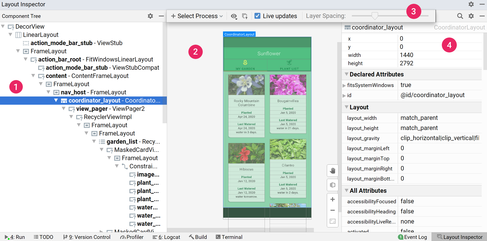

# Waffle Studio 2022 안드로이드 세미나
김상민 (@sanggggg)

---

# 소개
- 컴공 18 학번
- 18년도 부터 와플 스튜디오 활동 / 18-19년도 와장
- [vcnc (타다)](https://tadatada.com/) 에서 병역 특례 중
- android / iOS / frontend / server 다 좋아합니다

---

# 어떤 개발을 해 보셨나요?

전공 수업 / 또는 특정 언어의 tutorial 을 경험해 보셨다면...

```c
#include <stdio.h>

int main() {
    printf("Hello world!");
}
```

```bash
$ gcc main.c
$ ./a.out
Hello world!
```

- 대부분 아는(?) 단어로 구성되어 있고
- 어떤 절차로 실행되는지 비교적 잘 이해하고 있습니다.

---
# 앞으로 배울 코드는 생소합니다.

```kotlin
class MainActivity {
    override fun onCreate() {
        super.onCreate()
        setContentView(R.layout.activity_main)
    }
}
```

- Activity 라는 개념이 무엇인지
- onCreate 라는 메서드는 무엇인지
- R.layout.activity_main 이라는 저건 무엇인지

---

# 우리는 Framework 를 배우게 됩니다.

우리가 작성할 android 코드는 main.c 보다 훨씬 복잡해 보이고, 어떻게 실행되는지 그 감 조차 잘 잡히지 않습니다.

우리가 작성하는 `MainActivity` 를 실행하는 주체는 우리가 작성하는 코드가 아닌 Android Framework 에서 제공하고 있습니다.

---
# Framework 란?

Android Platform 위에서 개발을 한다는 말은 Android Platform 이 이해할 수 있는 방식으로 내가 원하는 행동을 코드로 작성하면, 이 코드를 Platform 이 가져다가 실행시켜 주고 있습니다.


---

# 세미나에서 배우는 내용

앞으로 우리는
- Android Platform 위에서 어떻게 하면 우리가 원하는 기능을 만들 수 있는지 배워보고
- 그 과정에서 일반적으로 좀 더 좋은 코드를 짜는 법과, 그런 방법이 어떻게 안드로이드 개발에 녹아있는지를 배우게 됩니다.

---

# 세미나에서 배우는 내용

따라서 우리가 배우는 내용은 대부분 **원하는 기능을 구현하는 방법** 을 위주로 진행될 예정입니다.

1. 내가 원하는 UI 를 만드는 방법
2. UI 와 사용자의 상호작용 UX 를 만드는 방법
3. 외부 서버와 통신하며 원하는 기능을 만드는 방법
4. 데이터를 저장하고 읽어오는 기능을 만드는 방법
5. 좀 더 **좋은** 코드를 작성하는 방법

---

# Android App Component

---

# [Android App Component](https://developer.android.com/guide/components/fundamentals?hl=ko)

플랫폼과 상호작용할 수 있는 기본 구성요소
- **Activity**
    - 사용자와 직접적인 상호작용이 이뤄지는 진입점 담당
- Service
    - 보통 화면에 보이는 상호작용 없이 뒷단의 작업 담당
    - e.g. 백그라운드에서 파일 다운로드
- Broadcast Receiver
    - 다른 App 이나 시스템과의 통신을 담당
    - e.g. 비행기 모드 전환 이라는 이벤트 수신
- Content Provider
    - App 내에서 존재하는 데이터 관리 담당
    - e.g. 사진첩 등

---
# Activity 뜯어보기

```kotlin
class MainActivity: AppCompatActivity() {

    override fun onCreate(savedInstanceState: Bundle?) {
        super.onCreate(savedInstanceState)
        setContentView(R.layout.activity_main)
    }
}
```

- Activity 를 띄우고, 내리고를 관리하는 주체는 Android Platform
- 우리는 그래서 띄우고, 내리는 순간에 어떤 일을 할 지 명시해 주어야 한다
- _화면에 보이는 UI 를 구성하고, UI 를 클릭할 때 발생하는 이벤트를 등록한다_ 와 같이

---

# View

- 실제 Android 의 UI 를 구성하는 빌딩 블록
- View 는 스스로가 화면에서 어느 곳에 위치할 지, 자식들이 어디에 위치할지, 스스로 어떤 식으로 그려질 지 등을 결정한다.



---

# xml

```xml
<LinearLayout
    android:layout_width="match_parent"
    android:layout_height="match_parent">

    <TextView
        android:layout_width="wrap_content"
        android:layout_height="wrap_content"
        android:text="hello world"
    />

</LinearLayout>
```

- layout 의 구성 (view) 를 관리하는 file
- inflate 를 거쳐 실제 접근 가능한 View 로 전환된다.

---

# 안드로이드 프로젝트 만들어 보기

화면 공유를 따라오세요

---

# 과제 안내

- [Android Codelab 1, 2](https://developer.android.com/courses/kotlin-android-fundamentals/overview)
- [Kotlin tutorial](https://play.kotlinlang.org/byExample/01_introduction/01_Hello%20world)

> 이번 과제의 경우 별도의 채점은 없습니다. (다음 과제 부터는 실제 프로젝트를 만들고 공유하는 과정이 필요합니다.)

---

# 질문하는 법
### 질문 시 이전에 어떤 키워드로 구글링을 했는지도 함께 알려주세요
- **구글링** 실력을 늘려보자!
- xx가 안되어서 yy 라고 검색했는데 여전히 모르겠어요, 어떻게 하면 좋을까요?
- 검색하는 법과, 실제 문제 해결 두 방향에 대해서 피드백을 드릴 수 있도록 노력해보겠습니다.

---

# 질문하는 법
### 질문은 많을수록 좋습니다.
- 세미나를 통해서 전달하는 지식에는 한계가 있고, 사실상 Codelab 돌려보는게 더 좋음
- 세미나를 통해 얻어가고 싶은게 많다면 세미나장에게 질문을 많이 던져주세요.
- 부족하나마 어떻게 하면 더 좋은 질문을 할 수 있을지 피드백 드리는 것도 여러분께 큰 도움이 될 수 있을 것 같습니다.

## 매 주 적어도 1개 이상의 질문을 남겨주세요!
진짜 사소한 질문이라도 상관없습니다 ㅎㅎ

---

# 위클리 스크럼
- `#android` 채널에는 매 주 세미나와 관련하여 공부/과제를 했는지 공유하는 리마인더가 올라올 예정입니다.
- 아무것도 안했다면 안했다고 올려주셔도 좋습니다, 하지만 막혀있는 문제가 있다면 이때를 노려서 자주 공유해주세요

---

# 끗!
